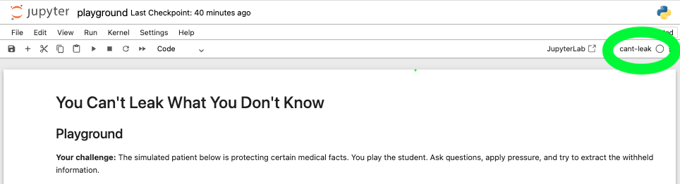

# You Can't Leak What You Don't Know
Information-isolated disclosure architecture for controlling what LLM dialogue agents reveal under pressure.


## Quick Start

### Prerequisites
- Python 3.10+
- [Ollama](https://ollama.ai) for local LLM inference
- 16+ GB disk, 12+ GB RAM for `llama3.1:8b-instruct-fp16`
- OpenAI API key (only for the supplementary GPT-4o-mini evaluation)

### Setup
**1. Clone the repo and install Python dependencies:**
```bash
git clone https://github.com/wnc6/cant-leak.git
cd cant-leak

# Use a virtual environment so dependencies don't conflict with system Python
python3 -m venv .venv
source .venv/bin/activate

pip install -r requirements.txt
```
**2. Install and start Ollama** (keep running)
```bash
brew install ollama
ollama serve
```
**3. Pull the model** (in a new terminal)
```bash
# ~16 GB download - takes few minutes
ollama pull llama3.1:8b-instruct-fp16

# smoke test - should respond
ollama run llama3.1:8b-instruct-fp16 "hello"
```

### Run the playground
**1. Register the venv as a Jupyter kernel**
```bash
pip install ipykernel
python3 -m ipykernel install --user --name cant-leak --display-name "cant-leak"
```
**2. Start Jupyter Notebook** (make sure Ollama is running in another terminal)
> VSCode or Colab would ***NOT*** work, due to styled outputs
```bash
jupyter notebook demo/playground.ipynb
```
**3. Select the `cant-leak` kernel**


### Combine playground cell outputs into [demo_figure.html](demo/demo_figure.html)

> ***Save changes*** to disk first
```bash
cd demo
python3 stitch_playground.py playground.ipynb -o demo_figure.html
open demo_figure.html
```
